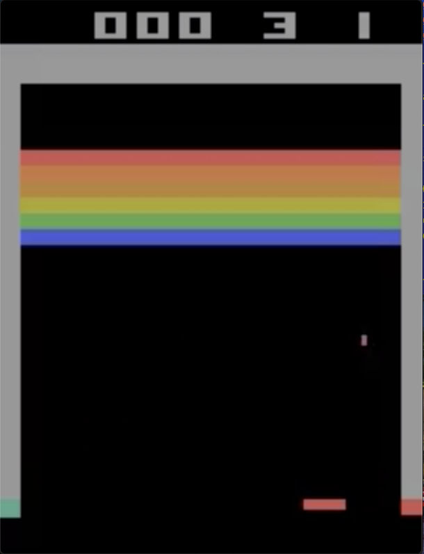

# Breakout_A3C
Breakout game played by an artificially intelligent agent with an A3C-LSTM implementation. 

### Asynchronous Advantage Actor-Critic (A3C)
The A3C algorithm makes use of many features implemented in conventional Convolutional 
Neural Networks (CNN's), with having the input of an image, applying one (or many) layers 
of convolution to downscale the image and maintain the spatial relationships of features 
within these images. After convolution, pooling is applied (usually max-pooling) and then
the data is flattened into a large single dimensional vector for entry into a neural network. 

The magic of A3C's comes into play after the output state recommendation from the CNN has been
obtained. The A3C model runs multiple agents to gain experience (all from different areas in
the environment). Multiplicity of the agents ensures the model does not get stuck in a local maximum, 
and also helps with optimizing the learning process of the model. Each of the agents passes inputs
into the same neural network, but different output states are obtained (after Softmax application). 
In addition to outputting the state action recommendation Q-value (a.k.a Actor), the model also 
outputs a V-value corresponding the current state the actor is in (a.k.a Critic). Critics are 
shared across all the agents in the environment, allowing multi-faceted learning. 

The Breakout-A3C model uses Pytorch to implement the AI backend. Various libraries like numpy 
have also been used to help with Tensor management. 

### Long Short-Term Memory (LSTM)
An implementation of LSTM has also been made within the model to allow the model to compare
spatial relationship between the ball (chief object of interaction in the Breakout game), and
the agent. LSTM allows the agent to have a memory of the previous positions of the ball, and
therefore allows it to accurately predict the optimal position to be in. 

LSTM was required within the model because the motion of the ball can occur at an angle, 
and a single snapshot in time cannot provide the agent with enough information with regards
to optimal positioning.

### Training
Training in the A3C models is, pound for pound, much more efficient as compared to their CNN
and ANN counterparts. The data that the model is fed for training if often much more complex in
A3C models, allowing them to solve problems much larger in scale as compared to their convolutional
and artifical neural network cousins. However, the task of training can be quite computer 
resource intensive as the data fed is often quite large. In the case of the Breakout A3C, the agent
plays games of Breakout and figures out spatial relationships between the ball and the paddle.
The progess of the AI can be seen via the mp4 videos that are created by the AI playing the game.

#### Required libraries
##### Run the following commands in the terminal to acquire the required libraries (Linux and MacOS)
* conda install -c akode gym
* conda install -c menpo ffmpeg
* conda install -c pytorch pytorch
* conda install -c conda-forge opencv

